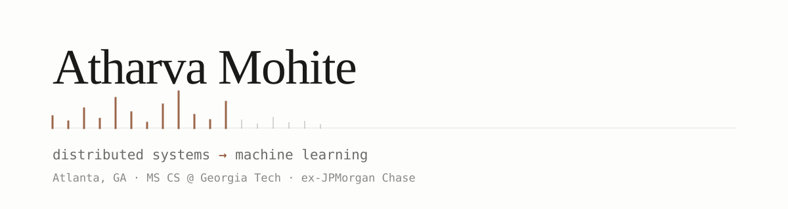

<picture>
  <source media="(prefers-color-scheme: dark)" srcset="assets/header-dark.svg">
  
</picture>

I spent close to four years at JPMorgan Chase on trade settlement infrastructure: pulling services
out of a monolith, closing the day's book inside a 30-minute cutoff, making 750k records searchable
in under 150ms. Since August 2026 I've been at Georgia Tech doing an MS in CS on the machine
learning track.

Most of what's here is small experiments. Usually something I couldn't settle by arguing about it,
so I ran it instead.

### Currently

- Coursework: machine learning, big data systems, data visualization
- Reading coding-agent trajectories to work out how early you can tell a run is doomed
- Benchmarking open-weight models on tasks where the answer is checkable rather than tasteful

### Things I've built

| | |
|---|---|
| **[llm-prompting-lab](https://github.com/moriowen/llm-prompting-lab)** · [live](https://llm-prompting-lab.vercel.app/) | 14,935 graded trials over seven self-hosted models, eleven temperatures, four prompting strategies. Both tasks have exactly one right answer, so grading needs no model in the loop. Temperature barely moves accuracy, and on reversal two strings account for a model's entire score. |
| **[word2vec-lab](https://github.com/moriowen/word2vec-lab)** · [live](https://word2vec-lab.vercel.app/) | Five word2vec models, trained or downloaded or fine-tuned, on one corpus, scored through a single untuned classifier. Skip-gram with negative sampling written from scratch in PyTorch. |
| **[Canary](https://moriowen.github.io/projects/canary/)** | Predicts whether a coding agent's run will fail from its first few steps. 25% less compute for a one-point drop in solve rate, 0.80 PR-AUC on a task-controlled evaluation, over 80k Agent SWE Bench trajectories. |
| **[peachtree-jeopardy](https://github.com/moriowen/peachtree-jeopardy)** | Buzzer server for a house Jeopardy night. Phones buzz, the TV shows the board, the host judges from a private control page. |
| **[moriowen.github.io](https://github.com/moriowen/moriowen.github.io)** | My site. Astro, static, zero client JavaScript. |

### Papers

Four from undergrad, on video understanding and computer vision. The first one reads a license
plate in a single frame; the last one asks a long surveillance video a question in plain English.

- [Leveraging LLMs for Video Querying](https://moriowen.github.io/publications/leveraging-llms-for-video-querying/), IEEE 2023. GPT-4 hit 56% exact timestamp matching, 85% within two minutes.
- [Keyframe Extraction assisted Crime Detection](https://moriowen.github.io/publications/keyframe-extraction-assisted-crime-detection/), IEEE 2023. Twelve configurations on UCF-Crime, best average accuracy 84.53%.
- [Computer Vision Techniques in Autonomous Vehicles: A Survey](https://moriowen.github.io/publications/computer-vision-in-autonomous-vehicles/), ICCIP 2022.
- [SecurePark: Vehicle Intrusion Detection System](https://moriowen.github.io/publications/securepark/), IEEE 2021. My first paper, and the one where the hard part turned out to be integration rather than the model.

### Elsewhere

[Site](https://moriowen.github.io) · [Scholar](https://scholar.google.com/citations?hl=en&user=wMiMf_wAAAAJ) · [LinkedIn](https://www.linkedin.com/in/atharva-mohite/) · [Email](mailto:amohite8@gatech.edu)

Away from a keyboard: boxing, pool, lifting, running, dancing, cooking, writing. Collecting places to go and poems worth rereading.
